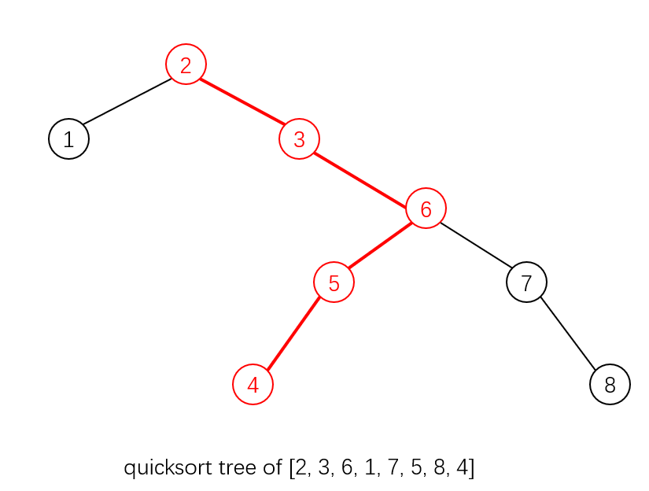

@import "homework.less"

# Exercise 1

If we want to find the maximum item in $n$ items, to ensure it is the maximum, it should be compared with all others directly or indirectly, so any algorithms should be at least $n-1$ comparisons. 

If not, there is no comparison between the "maximum" and some others, and we can not ensure its correctness.

# Exercise 2

Record the maximum and the minimum.

Fetch $2$ items each time, compare them, compare the smaller item and the minimum, and compare the bigger item and the maximum.

The algorithm shows below.

@import "2.ex.2.py"

The algorithm all use $1+(\frac{n-2}{2})\times 3=\frac{3n}{2}-2$ comparisons.

# Exercise 3

Each time compare two items, take the larger one to the next round, and after $k-1$ rounds, there are two items. Compare them, and get the "max" and the "second".

Then find the items those were compared with the "max", compare them with "second". the maximum is the second largest item.

The algorithm shows below.

@import "2.ex.3.py"

It all uses $\frac{n}{2}+\frac{n}{4}+\cdots+2+1+(k-1)=n+k-2=n+\log_2(n)-2$ comparisons.

# Exercise 4

Set the expected number of comparisons as $S$.

$$\begin{aligned}
S&=\mathbf{E}[\sum_{i\neq j} A_{i,j}]\\
&=\sum_{i\neq j}\mathbf{E}[A_{i,j}]\\
&=\sum_{i}\sum_{j}\frac{1}{|i-j|+1}-n
\end{aligned}$$

Now considering the summation,as matrix (1) shows, the summation of the matrix equals the summation.

$$\begin{aligned}
\begin{pmatrix}
1&\cfrac{1}{2}&\cfrac{1}{3}&\cdots& &\cfrac{1}{n}\\
\cfrac{1}{2}&1&\cfrac{1}{2}&\cdots&&\cfrac{1}{n-1}\\\cdots
& &...\\
\cfrac{1}{n-1}&\cfrac{1}{n-2}& &\cdots&1&\cfrac{1}{2}\\
\cfrac{1}{n}&1&\cfrac{1}{n-1}&\cdots&\cfrac{1}{2}&1\\
\end{pmatrix}
\end{aligned}$$

Using the Harmonic number $H_{n}=1+\frac{1}{2}+\cdots+\frac{1}{n}$

$$\begin{aligned}
S&=\sum_{i}\sum_{j}\frac{1}{|i-j|+1}-n\\
&=n\times 1+2\times(n-1)\times\frac{1}{2}+2\times(n-2)\times\frac{1}{3}+\cdots+2\times(n-(n-1))\times\frac{1}{n}-n\\
&=2\left(\frac{n}{2}+\frac{n}{3}+\cdots+\frac{n}{n}-\frac{1}{2}-\frac{2}{3}-\cdots-\frac{n-1}{n}\right)\\
&=2\left(n\left(\frac{1}{2}+\frac{1}{3}+\cdots+\frac{1}{n})-(\frac{1}{2}+\frac{2}{3}+\cdots+\frac{n-1}{n}\right)\right)\\
&=2\left(n\left(H_{n}-1\right)-\left(\left(1-1\right)+\left(1-\frac{1}{2}\right)+\left(1-\frac{1}{3}\right)+\cdots+\left(1-\frac{1}{n}\right)\right)\right)\\
&=2\left(n\left(H_{n}-1\right)-\left(n-H_{n}\right)\right)\\
&=2\left(n+1\right)H_{n}-4n
\end{aligned}$$

Which is the expected number of comparisons.

# Exercise 5

The QuickSelect method first chooses a random pivot $k$, and divide the array into $k$ and two parts: bigger than $k$, smaller than $k$, which is same as quicksort.

However, quickselect only concern one of the two parts, and omit the other, while quicksort concern the both. So we can say that quickselect is a “partial execution” of quicksort.

The example quicksort tree to find $4$ shows in Figure 1, and the red part is visited by quickselect.

{width=50%}

# Exercise 6

If $\mathbf{E}[B_{i,j,k}]=1$, then $k$ is the ancestor of $i$ and $j$.

Considering the Lemma of $A_{i,j}$:$A_{i,j}=1$ if and only if among the elements of $[i:j]$, element i comes first in the input array.

So, $B_{i,j,k}=1$ if and only if i comes first in $[i,j]$ and $[i,k]$.

The length of section is $\max(i,j,k)-\min(i,j,k)$, so $B_{i,j,k}=\dfrac{1}{\max(i,j,k)-\min(i,j,k)+1}$.

$$\mathbf E(B_{i,j,k})=\frac{1}{\max(i,j,k)-\min(i,j,k)+1}$$

# Exercise 7
$$C(\pi,k)=\sum_{i\neq j} B_{i,j,k}$$

# Exercise 8

$$\begin{aligned}
\mathbf E(C(\pi,1))&=\mathbf E\left(\sum_{i\neq j} B_{i,j,1}\right)\\
&=\sum_{i\neq j}\dfrac{1}{\max(i,j)}\\
&=2n-H(n)\\
&=2n-\ln n+o(1)
\end{aligned}$$

# Exercise 9

$$\begin{aligned}
\mathbf{E}_{\pi}[C(\pi,k)]
&=\sum_{i\neq j}\frac{1}{\max(i,j,k)-\min(i,j,k)+1}\\
&=2n-H(k)-H(n-k+1)+2\sum_{i=1}^{n-k}\left(H(k+i)-H(i+1)\right)\\
&=2\left(n+\ln\frac{n!}{k!(n-k)!}-\ln k-\ln(n-k+1)\right)+o(n)
\end{aligned}$$

By the Stirling's formula, we have

$$\begin{aligned}
\mathbf{E}_{\pi}[C(\pi,k)]
&=2\left(n+n\ln n-k\ln k-(n-k)\ln(n-k)\right)+o(n)\\
&=2n(1-\kappa\ln\kappa-(1-\kappa)\ln(1-\kappa))+o(n)
\end{aligned}$$
